# Object Detection in an Urban Environment

## Summary
The aim of this project is to create a convolutional neural network to detect and classify objects in an urban environment. These objects are vehicles, pedestrians and cyclists. In this project the TensorFlow Object Detection API is applied to create predictions and the Waymo open dataset as data basis to build a model and get predictions on images. Finally, the model is use to create short videos for model predictions.

An extensive data analysis is done to select meaningful data augmentations that foster the training process of the model. Additionally, hyperparameter tuning and experimenting with different optimizers is conducted to improve the model's performance.  

## Setting up the environment
First of all, setting up and running the whole pipline beginning with downloading the data, preprocessing the data right up to building a model is only possible on Linux based systems as the python package `waymo_open_dataset` is currently not supported on MacOS or Windows based systems. 

1. Create a new Python 3.8 virtual environment and use the package manager [pip](https://pip.pypy.io/en/stable) to install all required packages contained in the `requirements.txt` file.
2. This project is based on the data from [Waymo Open dataset](https://waymo.com/open/). The files can be downloaded directly from the website as tar files or from the [Google Cloud Bucket](https://console.cloud.google.com/storage/browser/waymo_open_dataset_v_1_2_0_individual_files/) as individual tfrecords and should be stored in a subfolder named `data` as depicted below. This project is based on 100 files and the downloading and processing is done by the python script `download_process.py`. Details are described below. Assuming the root directory is named SDC_OD the data are organized as follows:
```
SDC_OD/data/waymo
    - processed: contains the downloaded and processed data
    - training_and_validation: contains files to train and validate models
    - train: contains the training data (empty at the beginning)
    - val: contains the validation data (empty at the beginning)
    - test: contains files to test models and create inference videos 
```
After downloading and processing the data it is suggested to move three files to the `test` folder. The remaining 97 files are intended for training and validation. Copy these files to the `training_and_validation` folder.
3. Install the [TF Open Detection API](https://github.com/tensorflow/models/tree/master/research/object_detection). Installation instructions can be found on [Tensorflow 2 Object Detection API Tutorial](https://tensorflow-object-detection-api-tutorial.readthedocs.io/en/latest/install.html).
4. This project is based on a pretrained model. Download the [pretrained model](http://download.tensorflow.org/models/object_detection/tf2/20200711/ssd_resnet50_v1_fpn_640x640_coco17_tpu-8.tar.gz), then move it to `SDC_OD/experiments/pretrained_model/` and unzip it. The Tf Object Detection API relies on **config files**. The configuration that is used for this project is `pipeline.config`, which is the config for a SSD Resnet 50 640x640 model. For this project, a changed config file was created, which is named `pipeline_new.config` and stored in `SDC_OD/experiments/reference`.

The final project scaffold looks as follows:
```
SDC_OD
├── README.md                         # This file.
├── README.html                       # HTML version of the README file.
├── create_splits.py                  # Script to create train/test splits.
├── download_process.py               # Script to download/process waymo data.
├── edit_config.py                    # Script to edit pipline.config files.
├── Exploratory Data Analysis.ipynb   # Data analysis results.
├── Explore augmentations.ipynb       # Data augmentation experiments.
├── filenames.txt                     # Files to be downloaded from waymo.
├── inference_video.py                # Script to create mp4 videos.
├── label_map.pbtxt                   # Mapping from label ids to label names.
├── LICENSE.md                        # License information.
├── pipeline.config                   # Original pipline.config file (template).
├── pipeline_new.config               # Edited pipeline.config file.
├── requirements.txt                  # List of Python packages to be installed.
├── utils.py                          # File with utility functions.
├── animations                        # Example animations.
│   └── ...
├── data                              # Folder to store the data (see above).
│   └── ...
├── images                            # Images used in this readme file.
│   └── ...
└── experiments                       # Folder to store experiments.
    ├── reference
    │   └── pipeline_new.config       # Config file created to train the model.
    ├── pretrained_model
    │   └── ...                       # Single Shot Detector (ssd_resnet50_v1) used in this project.
    ├── exporter_main_v2.py           # Script to export the trained models.
    ├── model_main_tf2.py             # Script to train and validate models.
    └── label_map.pbtxt               # Mapping from label ids to label names.
```

## Functions and Files
The following functions and files are provided to attain the project's goal:

- **download_process.py**: This file contains python functions to download and process waymo data. The `create_tf_example` function takes the components of a Waymo Tf record and saves them in the Tf Object Detection API format. The files to be downloaded are collected in the `filenames.txt` file. All files will be downsampled by the function `process_tfr`. One of every 10 frames will be selected from 10 fps videos. If enough memory is available, the part which downsamples the images can be removed.

You can run the script using the following command:
```
python download_process.py --data_dir {processed_file_location} --size {number of files you want to download; default: 100}
```

- **create_splits.py**: This script splits (moves) the `training_and_validation` data into appropriate `train` and `val` sets. The following subfolders are expected to be there: `SDC_OD/data/waymo/train/`, `SDC_OD/data/waymo/val/`. Details regarding the train/test strategy can found below.
The script can be run using the following command from the project's root directory:
```
python create_splits.py --source ./data/waymo/training_and_validation --destination ./data/waymo
```
A new config file will be created, `pipeline_new.config`, which has to be moved to `experiments/reference`.

- **edit_config.py**: This script edits the config file template to change the location of the training and validation files, as well as the location of the label_map file, the pretrained weights and the batch size. Each time a new train/test split is created, this script has to be run. Further amendments, e.g. changing the optimizer or data augmentation steps, can be done manually. The script can be run by the following command from the project's root directory:
```
python edit_config.py --train_dir ./data/waymo/train/ --eval_dir ./data/waymo/val/ --batch_size 2 --checkpoint ./experiments/pretrained_model/ssd_resnet50_v1_fpn_640x640_coco17_tpu-8/checkpoint/ckpt-0 --label_map ./experiments/label_map.pbtxt
```

- **Exploratory Data Analysis.ipynb**: This jupyter notebook contains the results of the exploratory data analysis conducted for this project. A detailed description of the functions and their usage can be found there.

- **Explore augmentations.ipynb**: This notebook shows the results of a data augmentation strategy selected to improve the model's performance.

- **model_main_tf2.py**: This script is used to train and validate models. The edited config file is required and expected to be stored in the `experiments/reference` folder.
  - Starting a training process from the project's root directory:
    ```
    python ./experiments/model_main_tf2.py --model_dir=./experiments/{model_experiment_folder}/ --pipeline_config_path=./experiments/reference/pipeline_new.config
    ```
  - Concurrently to the training, start the evaluation process from the project's root directory in a different terminal window:
    ```
    python ./experiments/model_main_tf2.py --model_dir=./experiments/{model_experiment_folder}/ --pipeline_config_path=./experiments/reference/pipeline_new.config --checkpoint_dir=./experiments/{model_experiment_folder}
    ```
    Calling `export CUDA_VISIBLE_DEVICES=-1` before starting the evaluation process avoids using the GPU for evaluation. Instead only the CPU will be used for it.

    As the evaluation script has a timeout of 3600 seconds, it may be necessary to terminate it manually using
    `CTRL+C` after the last model checkpoint was evaluated.

    The training and evalution processes can be monitored in tensorboard by starting tensorboard in a new terminal window. From the project's root directory launch a tensorboard instance by the following command:
    ```
    python -m tensorboard.main --logdir ./experiments/{model_experiment_folder}
    ```
    Start a browser and monitor the train/eval process.

- **exporter_main_v2.py**: This scipt exports a trained model. For that, a new folder `experiments/reference/exported/saved_model` should be created. More information about the TensorFlow SavedModel format is available [here](https://www.tensorflow.org/guide/saved_model). Run the following (adjusted) command from the project's root directory:
```
python ./experiments/exporter_main_v2.py --input_type image_tensor --pipeline_config_path ./experiments/reference/pipeline_new.config --trained_checkpoint_dir ./experiments/{model_experiment_folder} --output_directory ./experiments/reference/exported/
```

- **inference_video.py**: This script creates a video of a model's inferences for any tfrecord file. To to so, run the following (adjusted) command from the project's root directory:
```
python inference_video.py --labelmap_path label_map.pbtxt --model_path ./experiments/reference/exported/saved_model --tf_record_path ./data/waymo/test/{tfrecord_file} --config_path ./experiments/reference/pipeline_new.config --output_path ./experiments/{model_experiment_folder}/animation.mp4
```

## Dataset
### Dataset analysis
The data analysis started with loading a random sample of ten images to get an impression what kind of images are contained in the dataset. Some example images including the bounding boxes of relevant objects are displayed below. More can be found in `Exploratory Data Analysis.ipynb`.

<p float="left">
  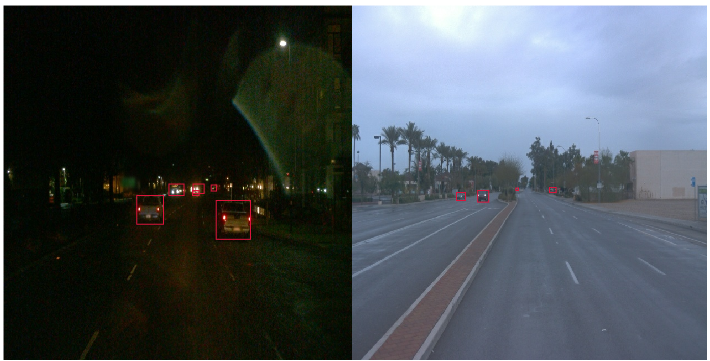
</p> 
<p float="left"> 
  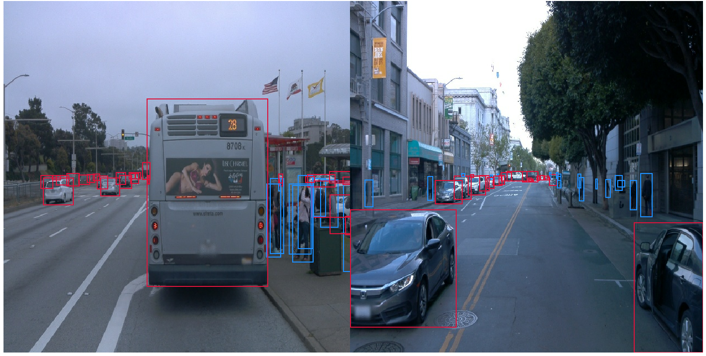
</p>

As you can see, objects are of different sizes and frequencies. The size of an object depends not only on its physical dimensions but also on how close or distant it is from the viewer.

#### Colors and Image Quality
Next, the images where investigated with respect to their color distributions and their quality. The following diagram shows the distribution of the pixel values over all images for the three channels red, green and blue. There are two peak areas. The first peak is between 60 and 100 (low to medium intensity), the second at about 250 (high intensity).

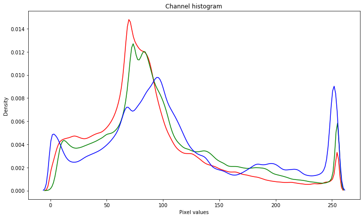

To get a better idea of what this distribution means, images were further investigated with respect to their quality. It was tried to classify them into three categories: (1) Dark images, (2) blurry images and (3) bright images. These differences are relevant for training a high performing model. Images were converted vom RGB to HLS format in order to utilize the lightness channel to identify dark images. The focus measure (variance of the Laplacian of an image converted into gray) helped to identify blurry images. All other images that were not captured by these criteria were classified as bright. Details regarding the calculations can be found in the Jupyter Notebook `Exploratory Data Analysis.ipynb`. The criteria worked not perfectly but helped to get an overview of the frequencies of these image types: 8 images were classified as dark, 16 as blurry and 73 as bright. Examples are shown below.

<p float="left">
  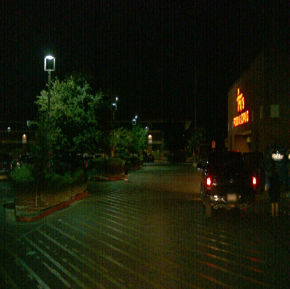
  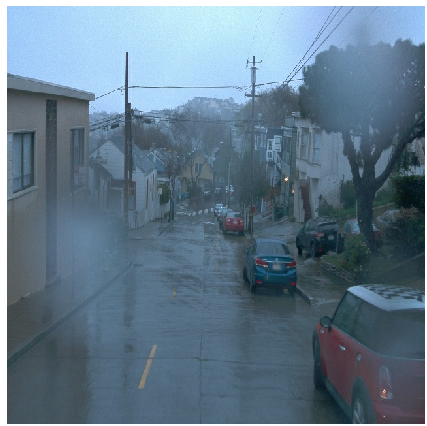
  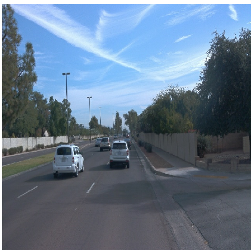 

  <em> Examples for dark, blurry and bright images </em>
</p>

#### Classes distributions
Finally, the distribution of the classes (vehicle, pedestrian, cyclist) over the images was investigated, i.e. how often on average each class occurs. For that, the first 10000 images of each tfrecord were selected and the average amount of objects for each class was determined.

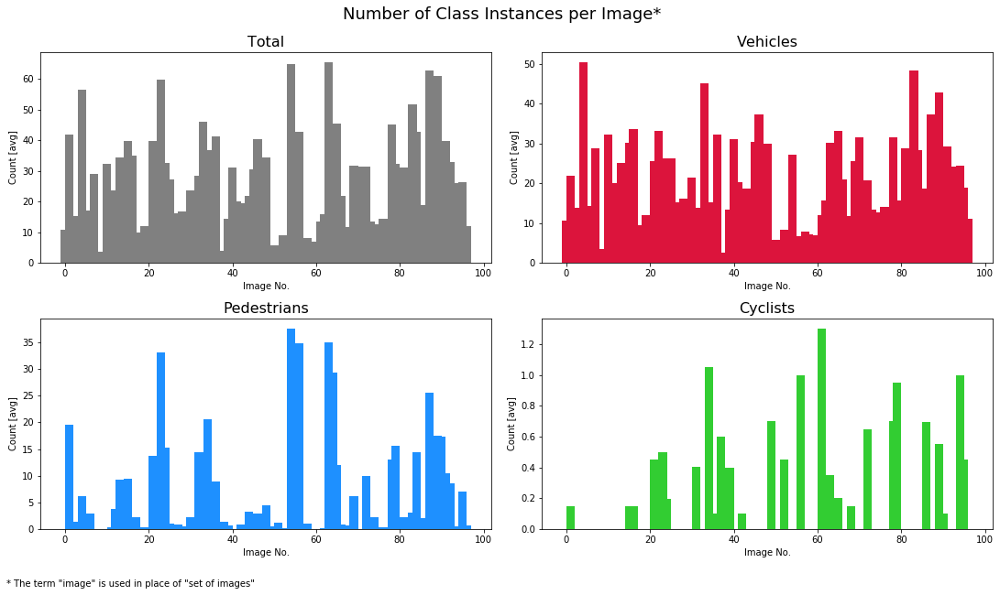

As can be seen in the diagrams above, vehicles are the dominant class over all image sets. Some images contain lots of vehicles whereas a small amount of image sets displays only a low number of vehicles. As the amounts are averages over sets of 10000 images, it can be expected that some images contain no vehicle at all.

There are lots of image sets with no pedestrians and even more with no cyclists. As there is no clustering of image sets with and without pedestrains/cyclists over the whole set of tfrecords, respectively, you should not expect to get unbalanced training and test sets with respect to theses classes by randomly drawing samples, or put differently, both training and test sets will contain image sets with and without pedestrians/cyclists. 

Nevertheless the set of classes is unbalanced - there are more vehicles than pedestrians and more pedestrians than cyclists which might deteriorate the performance of a model in detecting pedestrians and cyclists.

### Cross validation
The cross validation strategy is mainly based on the fact that differences in the quality of the images (dark, blurry, bright) have a strong impact on model performance - e.g. identifying vehicles in the dark is a different challenge compared to recognizing vehicles in daylight. Therefore, images are randomly chosen from each group (dark, blurry, bright) according to the train/test ratio to build the training and test sets. The train size is set to 80% to make sure that enough data of each group is contained in the validation set - especially the dark-image group contains less then ten tfrecord files.

Although the data is not equally balanced with respect to the three classes (vehicles, pedestrians, cyclists), downsampling the dataset is not taken into consideration as the differences are not too big.

## Training
### Reference experiment
The reference model was build without data augementations and an Adam optimizer with a constant learning rate of 1e-7 which works well in many other settings.

#### Training and validation loss
The peformance of the reference model was not satisfying. Although the model learned something, the total loss (the sum of the classification, localization and regularization losses) did not reach values below 1.0. 

<p float="left">
  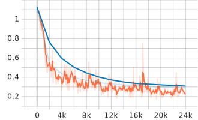
  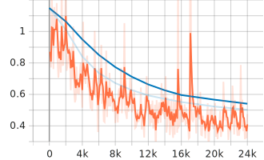
  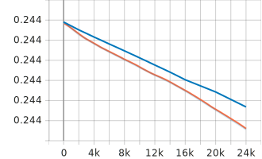
  
  <em> (1) Classification loss - (2) Localization loss - (3) Regularization loss </em> 
</p>

<p float="left">
  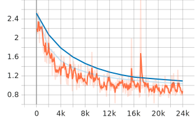
  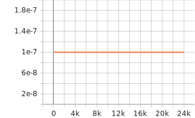

  <em> (1) Total loss - (2) Learning rate </em>
</p>

#### Model performance
Precision and recall were also disappointing, especially for small objects. This is confirmed in the example image shown below where the performances of the reference model and the improved model are compared.

##### Precision
<p float="left">
  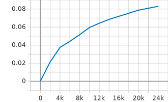
  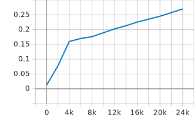
  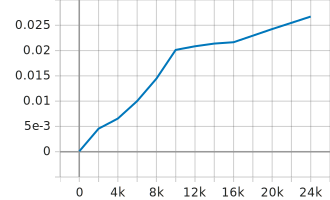
  
  <em> (1) Precision mAP - (2) Precision mAP (large) - (3) Precision mAP (small) </em> 
</p>

##### Recall
<p float="left">
  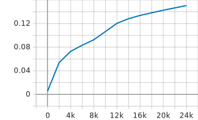
  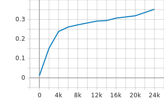
  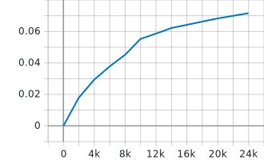
  
  <em> (1) Recall AR@100 - (2) Recall AR@100 (large) - (3) Recall AR@100 (small) </em> 
</p>

### Improve on the reference
To improve the models performance several changes were applied to the configuration:
1. The constant learning rate was changed to an exponantial decay learning rate, starting with a higher learning rate to accelerate training.
2. Further, data augmentations were used to increase image variability in order to improve the model's performance and to make it more robust. Only data augmentations that preserve the images structure were applied as a self driving car will usually not encounter vehicles upside down or strongly rotated. Thus, random adjustments to the brightness, contrast and hue of the images were added. Additionally, black patches are randomly applied to the images.

Details about supported data augmentations and optimizers can be found in the corresponding proto files of the object detection API: [optimizer proto](https://github.com/tensorflow/models/blob/master/research/object_detection/protos/optimizer.proto), [preprocessor proto](https://github.com/tensorflow/models/blob/master/research/object_detection/protos/preprocessor.proto). 

<p float="left">
  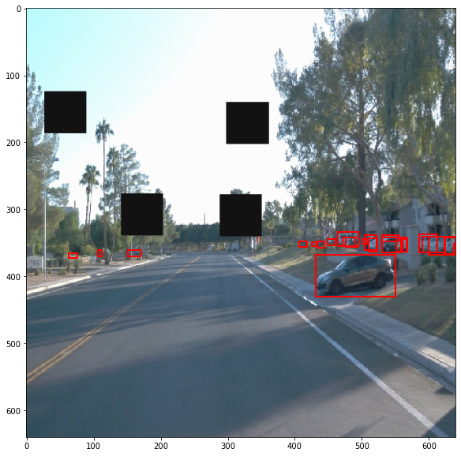
  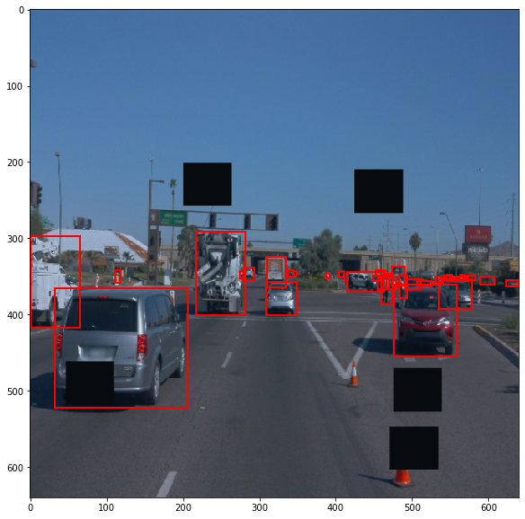

  <em> Example images after data augmentations </em>
</p>

#### Training and validation loss
Training and validation loss improved visibly after making the changes described above. All losses were decreasing right from the beginning and the final total loss stopped at about 0.8. Furthermore, the training loss was less volatile. 

Similar to the reference model, the localization loss is worse than the classification loss but much better than before.

<p float="left">
  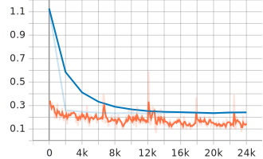
  
  
  
  <em> (1) Classification loss - (2) Localization loss - (3) Regularization loss </em> 
</p>

<p float="left">
  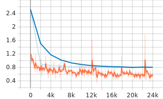
  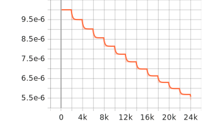

  <em> (1) Total loss - (2) Learning rate </em>
</p>

#### Model performance
The lower loss values are also reflected in a better model performance measured by precision and recall,
especially for large objects. Both values are now at about 60% compared to at about 30% in the reference model.

##### Precision
<p float="left">
  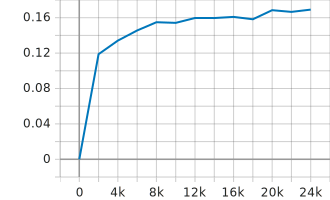
  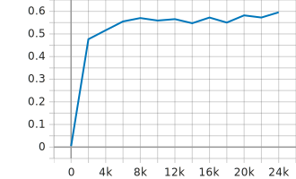
  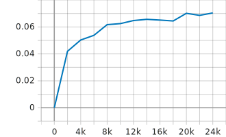
  
  <em> (1) Precision mAP - (2) Precision mAP (large) - (3) Precision mAP (small) </em> 
</p>

##### Recall
<p float="left">
  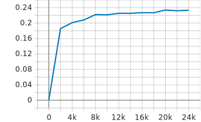
  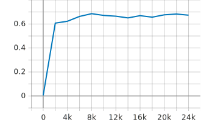
  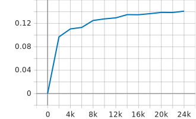
  
  <em> (1) Recall AR@100 - (2) Recall AR@100 (large) - (3) Recall AR@100 (small) </em> 
</p>

The images below show the impact of the new strategy on real images. On each image the model prediction is displayed on the left and the ground truth image on the right. As you can see, the improved model detects more objects, especially pedestrians, and with a higher probability.

<p float="left">
  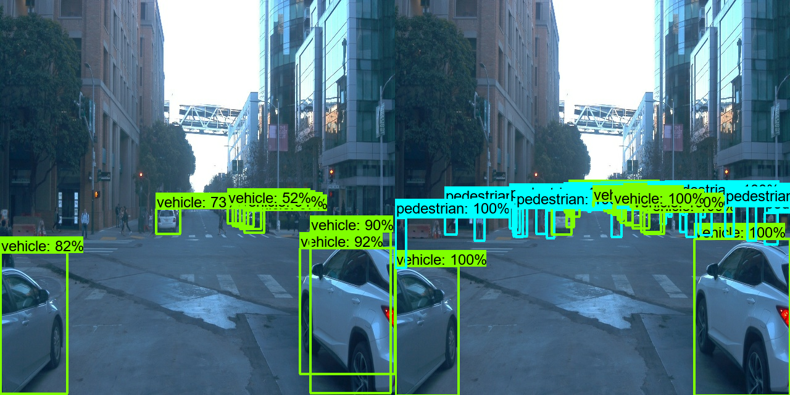
  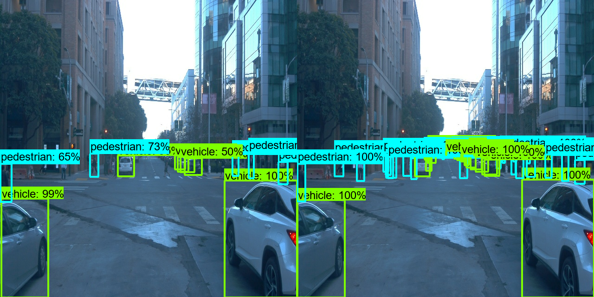

  <em> Image evaluation after 24000 training steps: (1) Reference model - (2) Improved model </em> 
</p>

